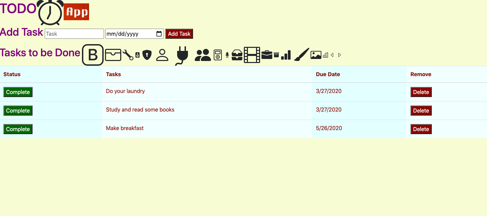

# TO DO APP

## Description 

_Duration: 2 day Sprint_

ToDo APP is a web app that enables people to better organize their day through setting tasks. The app allows people to create tasks for each day based on the priority they have for them. It is also up to the user to decide the urgency of the the tasks at hand. 

The aim of the app is to make the organization and planinning of our day so much more easier.So much more effective. In the process help people conserve their time and energy and be more productive.

To see the fully functional site, please visit: https://infinite-plateau-85667.herokuapp.com/

## Built with

- Node.js
- Express
- HTML5
- CSS
- JavaScript
- PostgreSQL
- Heroku

## Installation 

1. Download or clone this git repository.
2. Create a local repository.
3. Open your editor of choice and fun an npm install in the terminal.
4. Run the file in the editor.
5. Run npm start.

## Prerequisites

- [Node.js](https://nodejs.org/en/)
- [PostrgeSQL](https://www.postgresql.org/)

## Acknowledgement

Thanks to Prime Digital Academy who equipped and helped me to make this application a reality. I also want to thank my cohort who have been an invaluable support throughout this project. 

## Support

If you have suggestions or issues, please email me at damewold@gmail.com. 

